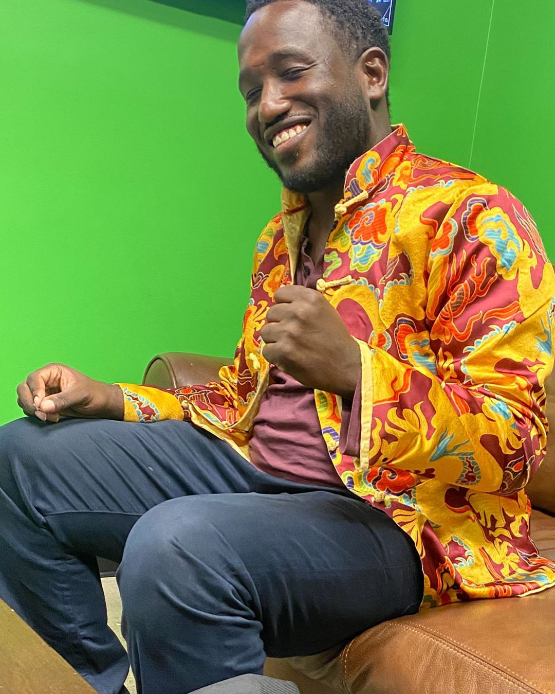
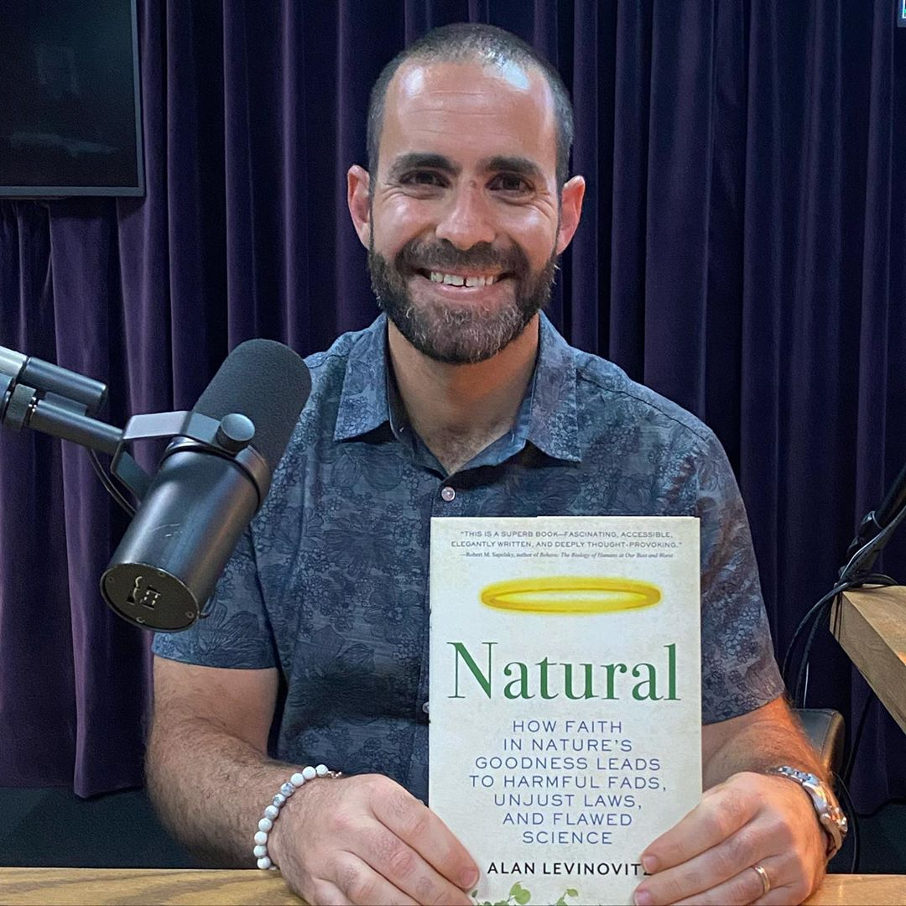
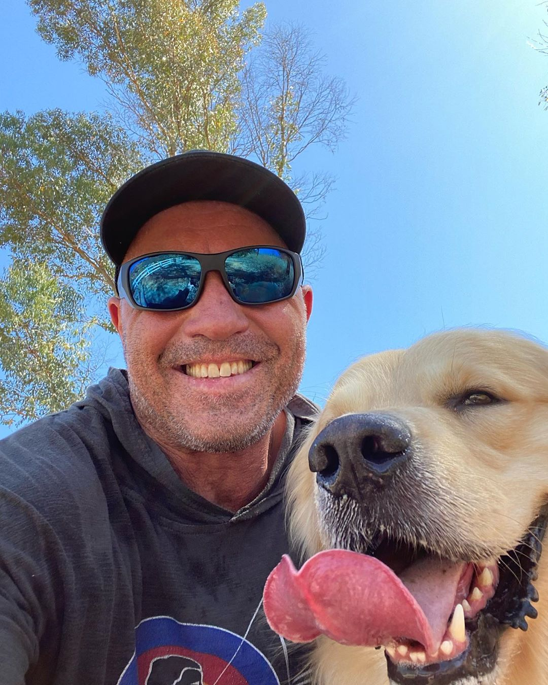
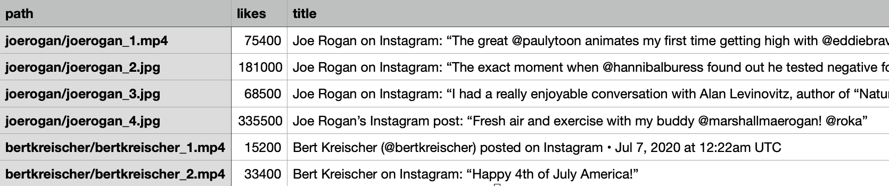

# Instagram Scapper

## Scrap Public Images/Videos and associated titles, likes, and views

## Tested on July of 2020 for MacOS Catalina

Images and videos are saved as.jpg and .mp4 files. Information on the number of likes (for .jpg), views (for .mp4), and titles are saved and exported as a separate .csv file.

<div align='center' min-width=820>
  
  
  
  
</div>

## Example Code

```
# Scrap the Instagram Profile of comedians Joe Rogan and Bert Kreischer
BASE_DIR = os.path.dirname(os.path.abspath(__file__))
indo = InstagramDownloader(
    dir_path=os.path.join(BASE_DIR, 'imgs_stats'), max_posts=5)
indo.download_profile('joerogan')
indo.download_profile('bertkreischer')
```

## Dependencies

Follow instructions from [here](https://pypi.org/project/selenium/) to install the Selenium WebDriver and the geckodriver for FireFox.

To avoid having to log in you should also install the [Instagram-guest Addon](https://addons.mozilla.org/en-US/firefox/addon/instagram-guest/) on the Selenium browser. If you have FireFox and the addon installed this should be done automatically. Otherwise, you want to update the lines 177-8 in the .py file.
